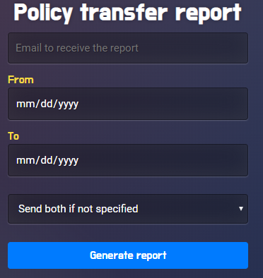

# Auto Report Generation
## Description
The purpose of this project is to generate four different types of error report for policy sync between Atlas and Phoenix. 
1.Policy failure general report: 

